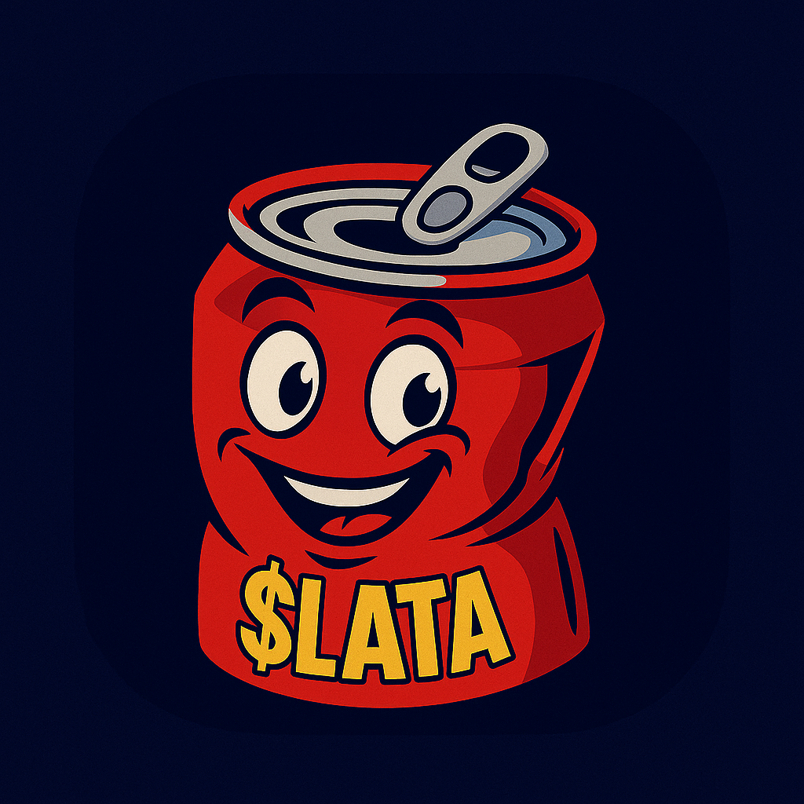

# 🥫 $LATA Token — Aluminum-inspired Meme Token on Polygon

  

  
  
  

---

### 🪙 Token Information

| Property | Details |
|-----------|----------|
| **Token Name** | LATA |
| **Symbol** | $LATA |
| **Total Supply** | 100,000,000 LATA |
| **Decimals** | 18 |
| **Standard** | ERC-20 |
| **Network** | Polygon (Chain ID: 137) |
| **Contract Address** | [`0x90A89254488d843cDfb55FD2Ba3f8d3C2df135e2`](https://polygonscan.com/address/0x90A89254488d843cDfb55FD2Ba3f8d3C2df135e2) |
| **Owner Verification** | ✅ Verified via PolygonScan |

---

## 🌍 Overview

**LATA** is a meme token inspired by **aluminum recycling** and **the circular economy** — blending humor, sustainability, and blockchain transparency.

> ♻️ “From aluminum cans to decentralized value — every LATA counts.”

---

## ⚙️ Smart Contract Details

- Fully verified on PolygonScan  
- Written in Solidity `^0.8.20`  
- License: MIT  
- Core functions:  
  - `transfer(address to, uint256 amount)` — send tokens  
  - `burn(uint256 amount)` — manually destroy tokens  
  - `balanceOf(address)` — check wallet balance  

---

## 🔗 Useful Links

- 🌐 [Website (GitHub Pages)](https://lolopetrov.github.io/latatoken/)
- 📊 [PolygonScan Contract](https://polygonscan.com/token/0x90A89254488d843cDfb55FD2Ba3f8d3C2df135e2)
- 🦊 [Add to MetaMask](https://polygonscan.com/token/0x90A89254488d843cDfb55FD2Ba3f8d3C2df135e2#tokenInfo)
- 💬 [Community Telegram (soon)](#)
- 💱 [QuickSwap Pair (coming soon)](#)
- 🧾 [Whitepaper (soon)](#)

---

## 🧭 Vision

The **LATA Project** aims to connect *real-world aluminum recycling* with *digital proof of value*.  
Each can could represent a measurable, verifiable asset — bridging Web3 and sustainable production.

Future roadmap:

- 🧩 **NFT certificates** for recycled aluminum lots  
- 🔗 **Proof-of-Recycling oracles**  
- 🤝 **Eco-collaborations** with circular economy projects  

---

## 🧠 Philosophy

> “Matter is value — and transparency is trust.”

$LATA isn’t just a meme.  
It’s a playful reminder that **recycling, transparency, and humor** can share the same chain.

---

## 🪪 License

Released under the [MIT License](LICENSE).

© 2025 **LATA Project** — *Aluminum-powered Meme Economy*  
Maintained by [@lolopetrov](https://github.com/lolopetrov)

---

  
   
  Light, shiny, and circular — just like aluminum.

